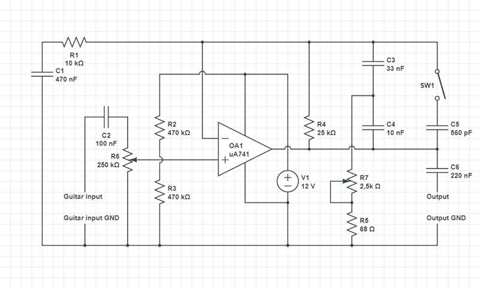

# *Guitar Tuner*

## 1. Overview
Guitar tuner is project based on STM32F407G microcontroller. Along with guitar preamplifier makes simple guitar tuner, which displays sound measurement on LCD screen.

## 2. Description
Project is made up of source code and guitar preamplifier scheme. Microcontroller software was written in C language, using following libraries

* [STM32 Standard Peripheral Libraries](https://www.st.com/en/embedded-software/stm32-standard-peripheral-libraries.html)
* [HD44780 for STM32Fxxx](http://stm32f4-discovery.net/2015/07/hal-library-15-hd44780-for-stm32fxxx/)

Projects realization requires building simple guitar preamplifier:

## 3. Components list
* 2x resistor 470kΩ
* 1x resistor 25kΩ
* 1x resistor 10kΩ
* 1x resistor 68Ω
* 1x adjustable resistor 250kΩ
* 1x adjustable resistor 2,5kΩ
* 1x capacitor 470nF
* 1x capacitor 220nF
* 1x capacitor 100nF
* 1x capacitor 33nF
* 1x capacitor 10nF
* 1x capacitor 560pF
* operational amplifier uA741
* power supply 12V
* SPST switch

Preamplifier should be built on a prototype board or solder on special tile.

## 4. Tools
* [STM32CubeMX](https://www.st.com/en/development-tools/stm32cubemx.html) (version 5.2.0)
* [System Workbench for STM32](https://www.st.com/en/development-tools/sw4stm32.html) (build 20170314-1500)

## 5. How to run
Connect LCD display and preamplifier following instructions:

* connect **preamplifier output** to STM32 **PA0 pin**
* connect **LCD RS pin** to STM32 **PC14 pin**
* connect **LCD E pin** to STM32 **PA1 pin**
* connect **LCD D4 pin** to STM32 **PB8 pin**
* connect **LCD D5 pin** to STM32 **PB6 pin**
* connect **LCD D6 pin** to STM32 **PB4 pin**
* connect **LCD D7 pin** to STM32 **PD7 pin**

Then, using dedicated IDE, build and install software into microcontroller. After enabling preamplifier and microcontroller tuner will start running.

## 6. License
Copyright (c) 2019 [Kamil Tomaszewski](https://github.com/ktomaszewski) and [Piotr Kalitka](https://github.com/piotrkalitka)

Permission is hereby granted, free of charge, to any person obtaining a copy of this software and associated documentation files (the "Software"), to deal in the Software without restriction, including without limitation the rights to use, copy, modify, merge, publish, distribute, sublicense, and/or sell copies of the Software, and to permit persons to whom the Software is furnished to do so, subject to the following conditions:
The above copyright notice and this permission notice shall be included in all copies or substantial portions of the Software.
THE SOFTWARE IS PROVIDED "AS IS", WITHOUT WARRANTY OF ANY KIND, EXPRESS OR IMPLIED, INCLUDING BUT NOT LIMITED TO THE WARRANTIES OF MERCHANTABILITY, FITNESS FOR A PARTICULAR PURPOSE AND NONINFRINGEMENT. IN NO EVENT SHALL THE AUTHORS OR COPYRIGHT HOLDERS BE LIABLE FOR ANY CLAIM, DAMAGES OR OTHER LIABILITY, WHETHER IN AN ACTION OF CONTRACT, TORT OR OTHERWISE, ARISING FROM, OUT OF OR IN CONNECTION WITH THE SOFTWARE OR THE USE OR OTHER DEALINGS IN THE SOFTWARE.

The project was conducted during the Microprocessor Lab course held by the Institute of Control and Information Engineering, Poznan University of Technology.
Supervisor: [Tomasz Mańkowski](https://github.com/Tomasz-Mankowski)
